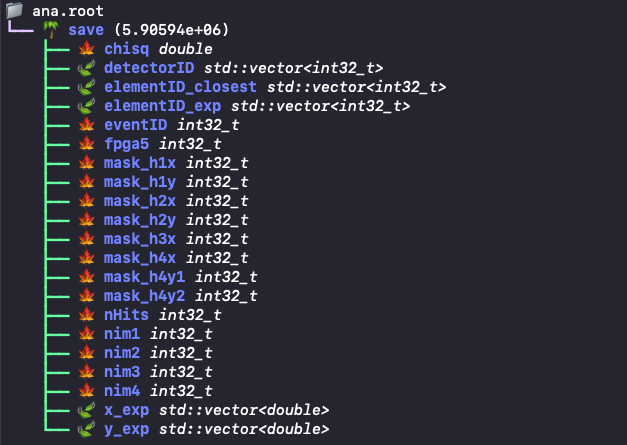

# A simple example of getting the efficiency of non-tracking detectors
Note: this module is intended to demonstrate how to use the reconstructed cosmic muons to calculate the efficiency of the detectors that do not participate in the tracking process. The user needs to be careful to add more cuts/controls to make sure the detector is not somehow required in the trigger/reconstruction and thus bias the efficiency measurement. Since in the cosmic ray reconstruction, no hodoscope masking or prop tube matching is required, it should be relatively straightforward.

## Structure
This directory contains the following parts:
- `run.C` serves as the main macro that calls the analysis module;
- `AnaModule` is an example module to demonstrate the usage of `Tracklet` class for efficiency measurement;
- `setup.sh` is the environment setup

## How to compile and run
This analysis module relies on the DST tree output generated by running the reconstruction. Please note that in the reconstruction macro (see `$E1039_ANALYSIS/RecoDev/RecoE1039Data.C` for example), the `set_enable_eval_dst(true)` needs to be called for the `SQReco` module. For simplicity, we assume the generated DST file is named `data.root` and located under the same directory.

To build the analysis module, run `source setup.sh` after the correct E1039 offline software environment is set, then run `rebuild-ana` to compile the analysis module.

After that, run `root -l -b -q run.C\(-1\)` to run the analysis over the input DST file `data.root`. Currently all the dark photon detectors and prop. tube detectors are included. User could add more detectors by its detector name after line 51 in `run.C`. The output file name is currently hardcoded to be `ana.root` at line 35 in `run.C`. If successful, the marco should exit with `ana.root` generated at the same directory.

## Understanding the content of the output
The output `ana.root` file is a plain ROOT ntuple file named `save` with 8 branches, user could modify the content of `AnaModule` to add more information. The ntuple is filled once per track per detector, thus it will contain multiple entries for the same event. The branches that are currently available are:

## Efficiency Plots
<<<<<<< HEAD
Efficincy plots can be created using the scripts in `work` directory. `debug` and `efficiency` notebooks can be used to generate all the plots.
=======

Efficincy plots can be created using the scripts in `work` directory. `debug` and `efficiency` notebooks can     be used to generate all the plots.
>>>>>>> 3aae19e8ebf38cfd23c9cf2d14652f0034cd57b0
